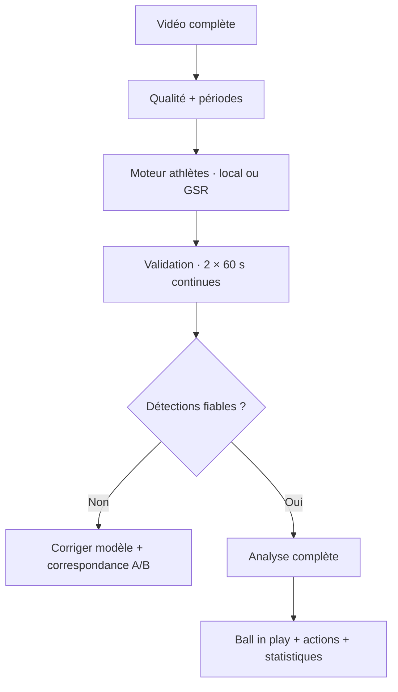

# Football Tracking

Plateforme locale d’analyse de matches de football à partir d’une vidéo complète. Elle accepte une captation qui commence avant l’entrée des équipes, sépare le temps vidéo du temps de match, propose les limites des deux mi-temps, suit les joueurs et le ballon avec un backend ML optionnel, estime le jeu effectif et la possession, transforme les changements de possession en actions vérifiables, puis produit des statistiques et des clips.

> **État du projet : socle fonctionnel et extensible.** Le mode `heuristic` fonctionne sans poids IA pour le diagnostic vidéo, les périodes et le mouvement caméra. Le mode `yolo` active la détection, le tracking, la possession et les actions, mais nécessite des poids football adaptés à votre angle de caméra. La qualité Wyscout/InStat ne vient pas d’un modèle générique seul : elle demande un jeu de données annoté, des évaluations par type de caméra et une boucle de validation humaine.

## Ce qui est déjà construit

- Import local d’un match complet : MP4, MOV, MKV, AVI ou M4V.
- Contrôle qualité global : résolution, netteté, exposition, présence du terrain et coupures.
- Détection reviewable des deux mi-temps, avec exclusion de l’avant-match, de la pause et de l’après-match.
- Double horloge immuable : `video_time_ms` et `match_time_ms`.
- Traitement indépendant de chaque mi-temps pour réinitialiser les trackers et limiter les dérives.
- Compensation pan/tilt/zoom par ORB, RANSAC et homographies par plan caméra.
- Projection métrique 105 × 68 m lorsque quatre points terrain ou plus sont fournis.
- Backend YOLO + BoT-SORT/ByteTrack local toujours disponible.
- Profil `native_gsr` entièrement Windows : ByteTrack, dédoublonnage des
  personnes, apparence agrégée par tracklet, liaison prudente des fragments et
  équipes apprises dans la vidéo. Il ne dépend pas de WSL.
- Adaptateur GSR versionné pour TrackLab + `sn-gamestate` ou le moteur
  SoccernetGSR Winner 2025, exécutés dans un environnement GPU séparé.
- Fusion des athlètes GSR (ReID, rôle, équipe, maillot, terrain) avec le
  détecteur de ballon local ; aucune fonctionnalité football n'est supprimée.
- Deux groupes de maillots appris automatiquement dans la vidéo par K-means,
  sans utiliser les couleurs décoratives saisies lors de l'import. Un bouton
  permet d'inverser une fois la correspondance groupe A/B vers les deux clubs.
- États `controlled`, `contested`, `loose`, `out`, `unknown` et segments de possession.
- Candidats passe, conduite, perte, récupération, duel, dribble, tir et sortie.
- Statistiques équipe/joueur, pistes non attribuées, affectation manuelle au roster.
- Timeline cliquable au timecode vidéo, validation/correction/rejet des actions.
- Clips FFmpeg des tirs, buts, duels, dribbles et tacles.
- Exports CSV et JSON, plus artefacts NDJSON de tracking.
- Worker séparé, progression dans l’interface et annulation propre.

## Architecture en une vue



Le détail des décisions techniques et des limites est dans
[docs/architecture.md](docs/architecture.md). La passerelle professionnelle est
documentée dans [docs/gsr-integration.md](docs/gsr-integration.md). Le moteur
Windows inspiré de ces travaux est décrit dans
[docs/native-gsr-windows.md](docs/native-gsr-windows.md).

Le profil `native_gsr` fonctionne directement sous Windows. L'installation WSL
ci-dessous ne concerne que l'exécution inchangée du pipeline officiel TrackLab
+ sn-gamestate et reste facultative :

```powershell
Set-ExecutionPolicy -Scope Process Bypass
.\scripts\gsr\install_tracklab_windows.ps1
```

Le script sauvegarde le `.env` avant toute activation et refuse par défaut un
calcul CPU impraticable. Aucun nouvel upload du match n'est nécessaire.

## Installation rapide — Windows 10/11

### Prérequis

1. [Python 3.12](https://www.python.org/downloads/) en cochant **Add Python to PATH**.
2. [Git](https://git-scm.com/download/win).
3. FFmpeg : `winget install Gyan.FFmpeg` puis redémarrer PowerShell.
4. Option ML recommandée : GPU NVIDIA, pilote récent et suffisamment de VRAM. Le mode CPU reste possible mais un match de 90 minutes sera lent.

```powershell
git clone https://github.com/hammouda93/football-tracking.git
cd football-tracking
Set-ExecutionPolicy -Scope Process Bypass
.\scripts\install_windows.ps1
.\scripts\start_local.ps1
```

Ouvrir ensuite [http://127.0.0.1:8000](http://127.0.0.1:8000). Le script de démarrage ouvre le serveur web et le worker d’analyse dans deux fenêtres PowerShell.

Pour activer le backend ML :

```powershell
.\scripts\install_windows.ps1 -WithML
Copy-Item .env.example .env -ErrorAction SilentlyContinue
# Ajouter models\football-players.pt, puis mettre ANALYSIS_BACKEND=yolo dans .env
.\scripts\start_local.ps1
```

Les classes attendues dans les poids sont documentées dans [models/README.md](models/README.md).

## Installation macOS / Linux

```bash
python3.12 -m venv .venv
source .venv/bin/activate
python -m pip install --upgrade pip
python -m pip install -r requirements.txt
cp .env.example .env
python manage.py migrate
python manage.py runserver
```

Dans un second terminal :

```bash
source .venv/bin/activate
python manage.py run_analysis_worker
```

Pour le ML, installer aussi `requirements-ml.txt`, placer les poids localement et modifier `.env`.

Le serveur Django et le worker sont volontairement séparés : l’interface reste réactive pendant plusieurs heures d’inférence et une interruption du navigateur n’arrête pas l’analyse.

## Premier match

1. Importer la vidéo. Les couleurs des clubs servent uniquement à l'interface ;
   la vision apprend les maillots directement sur les joueurs détectés.
2. Importer chaque effectif en CSV (`name,shirt_number,position`).
3. Cliquer sur **1. Détecter/recalculer les mi-temps**. La coupure centrale est proposée automatiquement ; vérifier puis confirmer les quatre limites vidéo modifiables.
4. Lancer **2. Test · 2 min (1 min/MT)**. Il applique exactement le moteur du match complet sur deux séquences continues de 60 secondes : une au centre de la MT1, puis une au centre de la MT2. Le live affiche uniquement les objets finaux afin qu’un joueur n’ait pas deux boîtes visuelles. Dans la fenêtre OpenCV, `D` affiche ou masque les détections YOLO brutes et `ESC` annule le test.
5. Vérifier la couverture joueurs, la stabilité des IDs, groupe A/B, gardiens, arbitres, OCR et ballon. Utiliser **Inverser les équipes A/B** si les noms sont retournés, puis relancer ce même test de 2 minutes.
6. Télécharger la pré-annotation CSV et la corriger si une mesure IDF1/HOTA objective est souhaitée.
7. Ne lancer **3. Analyse complète** que si le test de 2 minutes est validé. Le bouton reste verrouillé si le socle visuel échoue.
8. Dans **Identités**, rattacher les pistes au bon joueur lorsque le numéro n’est pas lisible.
9. Valider ou corriger les actions en regardant le clip ou le timecode, puis exporter les résultats.

Un aperçu sans vidéo peut être créé avec :

```bash
python manage.py create_demo_data
```

## Configuration

Les valeurs se trouvent dans `.env` :

| Variable | Défaut | Rôle |
|---|---:|---|
| `ANALYSIS_BACKEND` | `heuristic` | `heuristic` ou `yolo` |
| `ANALYSIS_ATHLETE_ENGINE` | `legacy` | `legacy`, `tracklab` ou `winner2025` ; le ballon reste séparé |
| `ANALYSIS_SAMPLE_SECONDS` | `1.0` | Pas initial de diagnostic |
| `ANALYSIS_QUALITY_MAX_SAMPLES` | `360` | Nombre maximal d’images lues directement pendant le contrôle qualité |
| `ANALYSIS_TRACKING_FPS` | `12.5` | Images analysées par seconde |
| `ANALYSIS_MIN_YOLO_TRACKING_FPS` | `12.5` | Cadence du profil de référence, équivalente à une image sur deux à 25 FPS |
| `ANALYSIS_DEVICE` | `cpu` | `cpu`, `0`, `cuda:0`, selon Ultralytics |
| `ANALYSIS_LIVE_WINDOW` | `1` sous Windows | Fenêtre OpenCV fluide pendant les tests courts |
| `YOLO_PROFILE` | `main_py` | `native_gsr` active le moteur Windows consolidé ; `main_py` conserve le témoin historique ; `advanced` expose les réglages bruts |
| `YOLO_MODEL_PATH` | `models/football-players.pt` | Poids locaux |
| `YOLO_CONFIDENCE` | `0.30` | Seuil de détection |
| `YOLO_BALL_CONFIDENCE` | `0.12` | Seuil séparé du petit ballon ; les joueurs restent à `0.30` |
| `YOLO_BALL_TILED_RECOVERY` | `1` en Native GSR | Récupération périodique du petit ballon par tuiles |
| `YOLO_IMAGE_SIZE` | `640` | Résolution d’inférence du prototype `main.py` |
| `YOLO_TRACKER` | `bytetrack` | Profil historique qui conserve le mieux les joueurs ; `botsort` reste disponible |
| `YOLO_TRACK_LOW_CONFIDENCE` | `0.30` | Seuil réellement envoyé à ByteTrack dans le profil de référence |
| `YOLO_NEW_TRACK_CONFIDENCE` | `0.25` | Confiance minimale pour créer un nouvel ID |
| `YOLO_TRACK_MATCH_THRESHOLD` | `0.80` | Tolérance d’association du tracker |
| `YOLO_TRACK_BUFFER_SECONDS` | `5.0` | Durée de conservation d’une piste brièvement perdue |
| `YOLO_PLAYER_CLASS_IDS` | `2` | IDs numériques des classes joueur, séparés par des virgules |
| `YOLO_GOALKEEPER_CLASS_IDS` | `1` | IDs numériques des classes gardien |
| `YOLO_REFEREE_CLASS_IDS` | `3` | IDs numériques des classes arbitre |
| `YOLO_BALL_CLASS_IDS` | `0` | IDs numériques des classes ballon |
| `NATIVE_GSR_REID_MODEL_PATH` | vide | Checkpoint OSNet/ONNX d'embeddings ; le script Windows installe OSNet x0.25 |
| `NATIVE_GSR_MAX_GAP_SECONDS` | `3.0` | Intervalle maximal pour réunir deux fragments compatibles |
| `NATIVE_GSR_JERSEY_ENGINE` | `auto` | EasyOCR ou classifieur ONNX 0..99, avec vote temporel |
| `NATIVE_GSR_PITCH_MODEL_PATH` | vide | Checkpoint ONNX de points terrain compatible |
| `NATIVE_GSR_PITCH_SCHEMA_PATH` | vide | Schéma sémantique exact des 97 sorties du checkpoint |
| `NATIVE_GSR_STRICT_VALIDATION` | `1` | Bloque la validation si Re-ID/OCR/roster/terrain manquent |
| `GSR_RUNNER_COMMAND_JSON` | `[]` | Commande argv JSON du sidecar TrackLab/Winner ; aucun shell implicite |
| `GSR_PRECOMPUTED_RESULT` | vide | Résultat GSR v1 déjà calculé, utile pour répéter les tests sans GPU |
| `GSR_TIMEOUT_SECONDS` | `43200` | Délai maximal du processus GSR externe |
| `GSR_FRAME_TOLERANCE_MS` | `120` | Écart maximal entre une image vidéo et sa prédiction GSR |
| `GSR_TRACKING_FPS` | `5.0` | Cadence séparée du moteur athlètes TrackLab ; le ballon conserve sa propre cadence |
| `GSR_BALL_BACKEND` | `yolo` | Détecteur local `yolo`, `heuristic` ou `none` associé aux athlètes GSR |
| `FFMPEG_BINARY` | `ffmpeg` | Binaire FFmpeg |
| `FFPROBE_BINARY` | `ffprobe` | Binaire ffprobe |

Diagnostic de la machine :

```bash
python manage.py diagnose
```

## Tests

```bash
python manage.py test
python manage.py test tests.test_pipeline
```

## Formats de données

- Temps en millisecondes, jamais en chaînes formatées dans la base.
- Coordonnées `image_normalized` dans `[0,1]` lorsque le terrain n’est pas calibré.
- Coordonnées `pitch_meters` sur 105 × 68 m lorsqu’une homographie est disponible.
- Un événement garde sa confiance, sa visibilité, sa source et son statut de validation.
- Le tracking complet est écrit en NDJSON pour ne pas charger tout le match en mémoire.

## Limites importantes

- Une caméra TV ne voit pas les joueurs hors champ : aucune IA ne peut récupérer une position absente de l’image.
- Les replays, gros plans, occultations et changements de plan cassent l’identité ; le projet conserve donc des **tracklets** et une validation d’identité.
- Le ballon est petit et rapide : des poids spécialisés, une résolution élevée et des annotations de votre caméra sont nécessaires.
- Les buts, fautes, hors-jeu, têtes et duels aériens fiables nécessitent un modèle temporel/action spotting, le contexte audio/scoreboard et une vérité terrain. Le socle expose ces types mais ne les invente pas.
- Les tirs déduits de trajectoire restent des candidats à vérifier.
- Vérifiez que vous avez les droits d’analyser la vidéo, surtout si elle concerne des mineurs.

## Feuille de route vers une qualité professionnelle

- Modèle de points-clés du terrain et calibration automatique à chaque plan.
- Détection du chronomètre/scoreboard avec OCR et détection des coups de sifflet.
- Ball tracker spécialisé haute fréquence et interpolation probabiliste.
- Re-identification longue durée, OCR des numéros et contraintes du roster.
- Modèle temporel SoccerNet pour buts, tirs, fautes, corners, touches et hors-jeu.
- Évaluation par type de caméra : mAP, HOTA/IDF1, erreur métrique, mAP action spotting et calibration des confiances.
- Active learning : réutiliser les corrections de l’analyste pour constituer le jeu d’entraînement local.

## Licence

Code sous licence MIT. Les vidéos, datasets et poids de modèles conservent leurs licences respectives et ne sont pas inclus dans le dépôt.
