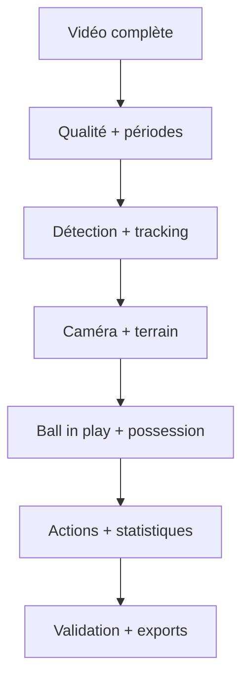

# Football Tracking

Plateforme locale d’analyse de matches de football à partir d’une vidéo complète. Elle accepte une captation qui commence avant l’entrée des équipes, sépare le temps vidéo du temps de match, propose les limites des deux mi-temps, suit les joueurs et le ballon avec un backend ML optionnel, estime le jeu effectif et la possession, transforme les changements de possession en actions vérifiables, puis produit des statistiques et des clips.

> **État du projet : socle fonctionnel et extensible.** Le mode `heuristic` fonctionne sans poids IA pour le diagnostic vidéo, les périodes et le mouvement caméra. Le mode `yolo` active la détection, le tracking, la possession et les actions, mais nécessite des poids football adaptés à votre angle de caméra. La qualité Wyscout/InStat ne vient pas d’un modèle générique seul : elle demande un jeu de données annoté, des évaluations par type de caméra et une boucle de validation humaine.

## Ce qui est déjà construit

- Import local d’un match complet : MP4, MOV, MKV, AVI ou M4V.
- Contrôle qualité global : résolution, netteté, exposition, présence du terrain et coupures.
- Détection reviewable des deux mi-temps, avec exclusion de l’avant-match, de la pause et de l’après-match.
- Double horloge immuable : `video_time_ms` et `match_time_ms`.
- Traitement indépendant de chaque mi-temps pour réinitialiser les trackers et limiter les dérives.
- Compensation pan/tilt/zoom par ORB, RANSAC et homographies par plan caméra.
- Projection métrique 105 × 68 m lorsque quatre points terrain ou plus sont fournis.
- Backend YOLO + ByteTrack pour joueurs, gardiens, arbitres et ballon.
- Classement des équipes par couleur de maillot avec vote sur toute la piste.
- États `controlled`, `contested`, `loose`, `out`, `unknown` et segments de possession.
- Candidats passe, conduite, perte, récupération, duel, dribble, tir et sortie.
- Statistiques équipe/joueur, pistes non attribuées, affectation manuelle au roster.
- Timeline cliquable au timecode vidéo, validation/correction/rejet des actions.
- Clips FFmpeg des tirs, buts, duels, dribbles et tacles.
- Exports CSV et JSON, plus artefacts NDJSON de tracking.
- Worker séparé, progression dans l’interface et annulation propre.

## Architecture en une vue



Le détail des décisions techniques et des limites est dans [docs/architecture.md](docs/architecture.md).

## Installation rapide — Windows 10/11

### Prérequis

1. [Python 3.12](https://www.python.org/downloads/) en cochant **Add Python to PATH**.
2. [Git](https://git-scm.com/download/win).
3. FFmpeg : `winget install Gyan.FFmpeg` puis redémarrer PowerShell.
4. Option ML recommandée : GPU NVIDIA, pilote récent et suffisamment de VRAM. Le mode CPU reste possible mais un match de 90 minutes sera lent.

```powershell
git clone https://github.com/hammouda93/football-tracking.git
cd football-tracking
Set-ExecutionPolicy -Scope Process Bypass
.\scripts\install_windows.ps1
.\scripts\start_local.ps1
```

Ouvrir ensuite [http://127.0.0.1:8000](http://127.0.0.1:8000). Le script de démarrage ouvre le serveur web et le worker d’analyse dans deux fenêtres PowerShell.

Pour activer le backend ML :

```powershell
.\scripts\install_windows.ps1 -WithML
Copy-Item .env.example .env -ErrorAction SilentlyContinue
# Ajouter models\football-players.pt, puis mettre ANALYSIS_BACKEND=yolo dans .env
.\scripts\start_local.ps1
```

Les classes attendues dans les poids sont documentées dans [models/README.md](models/README.md).

## Installation macOS / Linux

```bash
python3.12 -m venv .venv
source .venv/bin/activate
python -m pip install --upgrade pip
python -m pip install -r requirements.txt
cp .env.example .env
python manage.py migrate
python manage.py runserver
```

Dans un second terminal :

```bash
source .venv/bin/activate
python manage.py run_analysis_worker
```

Pour le ML, installer aussi `requirements-ml.txt`, placer les poids localement et modifier `.env`.

Le serveur Django et le worker sont volontairement séparés : l’interface reste réactive pendant plusieurs heures d’inférence et une interruption du navigateur n’arrête pas l’analyse.

## Premier match

1. Importer la vidéo et renseigner les couleurs principales des maillots.
2. Importer chaque effectif en CSV (`name,shirt_number,position`).
3. Lancer l’analyse. Le worker traite d’abord la qualité et propose deux mi-temps.
4. Confirmer les limites vidéo des mi-temps puis relancer l’analyse pour verrouiller l’horloge match.
5. Dans **Identités**, rattacher les pistes au bon joueur lorsque le numéro n’est pas lisible.
6. Valider ou corriger les actions en regardant le clip ou le timecode.
7. Exporter les événements CSV et le rapport JSON.

Un aperçu sans vidéo peut être créé avec :

```bash
python manage.py create_demo_data
```

## Configuration

Les valeurs se trouvent dans `.env` :

| Variable | Défaut | Rôle |
|---|---:|---|
| `ANALYSIS_BACKEND` | `heuristic` | `heuristic` ou `yolo` |
| `ANALYSIS_SAMPLE_SECONDS` | `1.0` | Pas initial de diagnostic |
| `ANALYSIS_TRACKING_FPS` | `10.0` | Images analysées par seconde |
| `ANALYSIS_DEVICE` | `cpu` | `cpu`, `0`, `cuda:0`, selon Ultralytics |
| `YOLO_MODEL_PATH` | `models/football-players.pt` | Poids locaux |
| `YOLO_CONFIDENCE` | `0.30` | Seuil de détection |
| `YOLO_IMAGE_SIZE` | `1280` | Résolution d’inférence |
| `FFMPEG_BINARY` | `ffmpeg` | Binaire FFmpeg |
| `FFPROBE_BINARY` | `ffprobe` | Binaire ffprobe |

Diagnostic de la machine :

```bash
python manage.py diagnose
```

## Tests

```bash
python manage.py test
python -m unittest tests.test_pipeline
```

## Formats de données

- Temps en millisecondes, jamais en chaînes formatées dans la base.
- Coordonnées `image_normalized` dans `[0,1]` lorsque le terrain n’est pas calibré.
- Coordonnées `pitch_meters` sur 105 × 68 m lorsqu’une homographie est disponible.
- Un événement garde sa confiance, sa visibilité, sa source et son statut de validation.
- Le tracking complet est écrit en NDJSON pour ne pas charger tout le match en mémoire.

## Limites importantes

- Une caméra TV ne voit pas les joueurs hors champ : aucune IA ne peut récupérer une position absente de l’image.
- Les replays, gros plans, occultations et changements de plan cassent l’identité ; le projet conserve donc des **tracklets** et une validation d’identité.
- Le ballon est petit et rapide : des poids spécialisés, une résolution élevée et des annotations de votre caméra sont nécessaires.
- Les buts, fautes, hors-jeu, têtes et duels aériens fiables nécessitent un modèle temporel/action spotting, le contexte audio/scoreboard et une vérité terrain. Le socle expose ces types mais ne les invente pas.
- Les tirs déduits de trajectoire restent des candidats à vérifier.
- Vérifiez que vous avez les droits d’analyser la vidéo, surtout si elle concerne des mineurs.

## Feuille de route vers une qualité professionnelle

- Modèle de points-clés du terrain et calibration automatique à chaque plan.
- Détection du chronomètre/scoreboard avec OCR et détection des coups de sifflet.
- Ball tracker spécialisé haute fréquence et interpolation probabiliste.
- Re-identification longue durée, OCR des numéros et contraintes du roster.
- Modèle temporel SoccerNet pour buts, tirs, fautes, corners, touches et hors-jeu.
- Évaluation par type de caméra : mAP, HOTA/IDF1, erreur métrique, mAP action spotting et calibration des confiances.
- Active learning : réutiliser les corrections de l’analyste pour constituer le jeu d’entraînement local.

## Licence

Code sous licence MIT. Les vidéos, datasets et poids de modèles conservent leurs licences respectives et ne sont pas inclus dans le dépôt.
