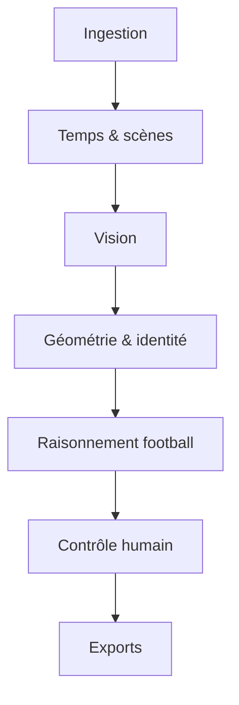
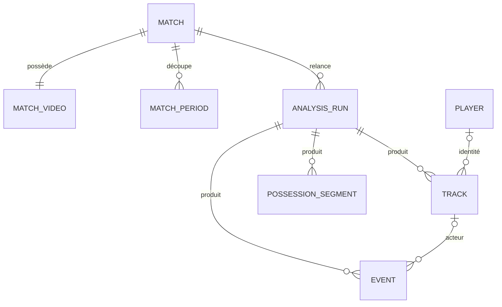

# Architecture technique

## Principe directeur

Une statistique n’est jamais calculée directement depuis la vidéo. La chaîne produit des preuves intermédiaires : qualité, périodes, pistes, mouvement caméra, possession, événements puis statistiques. Chaque couche peut être remplacée et évaluée séparément.

## Les deux horloges

La vidéo contient potentiellement un avant-match, quinze minutes de pause, des replays et un après-match. Son horloge ne doit jamais être confondue avec celle du football.

Pour une période confirmée :

\[
t_{match}=t_{début\_match}+\left(t_{vidéo}-t_{début\_vidéo}\right)
\]

`video_time_ms` reste la clé de retour à la preuve. `match_time_ms` sert à l’analyse sportive. Les arrêts de jeu dépassent naturellement 45:00 et 90:00.

## Étapes du pipeline

| Étape | Entrée | Sortie | Implémentation actuelle |
|---|---|---|---|
| Probe | fichier | durée, FPS, codec, taille | ffprobe, repli OpenCV |
| Qualité | échantillons répartis | note A/B/C/reject | netteté, exposition, terrain, cuts |
| Périodes | signaux temporels | deux plages vidéo | blocs terrain + fallback reviewable |
| Perception | frames de chaque période | joueurs, ballon, arbitres | provider `heuristic` ou YOLO |
| Tracking | détections | tracklets stables | ByteTrack |
| Caméra | frames | homographies plan/référence | ORB + RANSAC |
| Terrain | points-clés | coordonnées 105 × 68 m | `PitchProjector` |
| Jeu effectif | scène + ballon | état par frame | machine d’états avec temporisation |
| Possession | ballon + joueurs | segments équipe/joueur | plus proche joueur, lissage propriétaire |
| Actions | transitions | candidats horodatés | règles conservatrices et confiance |
| Statistiques | segments + actions | équipe/joueur | agrégateur déterministe |
| Clips | événements | MP4 | fenêtres fusionnées + FFmpeg |

## Mouvement caméra et coordonnées

Le pipeline sépare trois espaces :

1. `image_raw` : coordonnées originales dans la frame.
2. `image_normalized` : point stabilisé divisé par largeur/hauteur.
3. `pitch_meters` : projection sur un terrain canonique 105 × 68 m.

Le stabilisateur estime l’homographie frame courante → frame précédente, puis la compose vers la référence du plan. Une coupure franche réinitialise la référence. Une calibration terrain valide peut alors projeter les points stabilisés vers le terrain.

## Persistance

Les relances ne détruisent pas l’historique des runs. L’interface affiche le run le plus récent. Les statistiques consolidées pointent vers leur run source.

## Fiabilité

Chaque événement conserve :

- `confidence` : confiance numérique du producteur ;
- `visibility` : preuve complète ou partielle ;
- `source` et `model_version` ;
- `review_status` : pending, auto-accepted, validated, corrected ou rejected ;
- `clip` et `video_time_ms` pour audit.

Seuls les candidats très confiants peuvent être auto-acceptés. Le mode heuristique n’émet volontairement aucune identité de joueur ou fausse passe.

## Extension prévue

Les interfaces `VisionProvider`, `PeriodDetector`, `BallInPlayEngine` et `EventEngine` sont indépendantes. Un modèle SoccerNet, un OCR scoreboard, un détecteur de points-clés ou un tracker ReID peuvent donc remplacer une couche sans changer l’interface, la base ou les exports.
