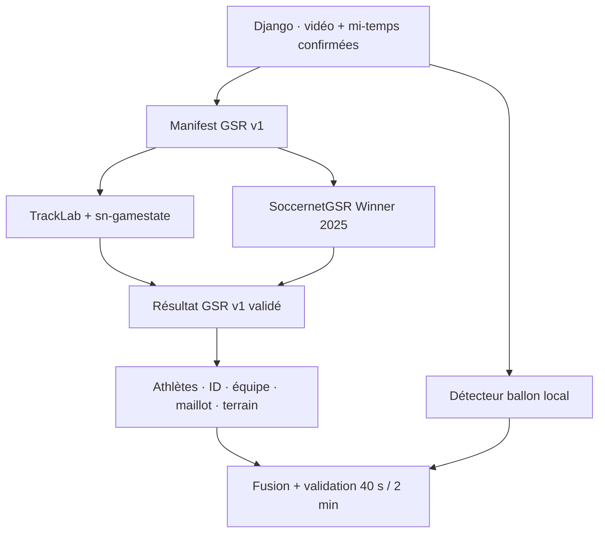

# Intégration GSR professionnelle

## Décision

Le projet conserve son pipeline Django, ses deux horloges, le contrôle qualité,
les tests 40 s / 2 min, le ballon, le jeu effectif, les événements et les
exports. Le suivi des personnes devient un composant interchangeable :

- `legacy` : YOLO + ByteTrack local, inchangé et toujours disponible ;
- `tracklab` : architecture maintenable TrackLab + `sn-gamestate` ;
- `winner2025` : moteur externe de comparaison fondé sur le gagnant GSR 2025.

Les moteurs lourds sont volontairement installés dans un environnement séparé.
Ils ont des versions Python, PyTorch, CUDA et OpenMMLab qui ne doivent pas
casser le `.venv` Django Windows.

## Ce qui est réellement intégré

Le dépôt fournit maintenant un runner exécutable
`scripts/gsr/sn_gamestate_runner.py`. Il ne simule pas GSR : il lance la
configuration officielle `soccernet.yaml` sur le mode `ExternalVideo` de
TrackLab, puis lit le vrai `TrackerState` produit par l'amont.

Les colonnes réellement importées sont :

- `bbox_ltwh` et `bbox_conf` pour la détection ;
- `track_id` pour l'association temporelle ;
- `role` et `role_confidence` pour joueur/gardien/arbitre ;
- `team_cluster` pour le KMeans automatique sur les embeddings Re-ID ;
- `jersey_number` pour le vote OCR sur toute la piste ;
- `bbox_pitch` pour la position métrique après calibration.

Les fenêtres confirmées sont extraites à la cadence GSR, réunies en une seule
vidéo avec six secondes noires entre les séquences. Cela évite qu'un ID survive
artificiellement à une coupure tout en laissant le regroupement d'équipe
s'effectuer globalement. Les couleurs saisies lors de la création du match ne
sont jamais utilisées pour classifier un joueur.



## Pourquoi cette séparation

La référence officielle `sn-gamestate` est construite sur TrackLab et enchaîne
détection, ReID, tracking, calibration, OCR du maillot, agrégation de tracklets
et affiliation d'équipe. TrackLab fournit l'état de tracker et les composants
modulaires ; `sn-gamestate` apporte les modules football.

Le dépôt [SoccernetGSR Winner 2025](https://github.com/yinmayoo185/SoccernetGSR)
annonce la victoire au challenge et réunit YOLOX, Deep-EIoU/OSNet, calibration
SFR, reconnaissance rôle/maillot et raffinement IDATR. Le
[rapport officiel 2025](https://arxiv.org/html/2508.19182v1#S5) publie un score
GS-HOTA de **63,90**, contre **29,01** pour la baseline indiquée dans ce rapport.
Il constitue donc la preuve de qualité et un moteur de comparaison. Son dépôt
racine ne publie toutefois pas de licence de réutilisation : aucun de ses
fichiers n'est copié ici et il ne peut être exécuté que comme logiciel externe
obtenu séparément.

Sources principales :

- [TrackLab](https://github.com/TrackingLaboratory/tracklab) — framework
  modulaire, licence MIT ;
- [SoccerNet sn-gamestate](https://github.com/SoccerNet/sn-gamestate) — pipeline
  GSR, licence GPL-3.0 ;
- [SoccernetGSR Winner 2025](https://github.com/yinmayoo185/SoccernetGSR) —
  référence gagnante, environnement Linux/NVIDIA/CUDA.

## Contrat `football-tracking.gsr/v1`

La commande externe reçoit toujours :

```text
<GSR_RUNNER_COMMAND_JSON> --manifest <chemin-vers-gsr-request.json>
```

Le manifest contient le chemin absolu de la vidéo, les fenêtres des mi-temps
confirmées, la cadence cible et trois sorties : résultat NDJSON, progression
JSON et aperçu JPG live. Le moteur ne doit analyser aucune image hors de ces
fenêtres.

Le premier enregistrement du NDJSON est obligatoire :

```json
{"type":"metadata","schema":"football-tracking.gsr/v1","engine":"tracklab","engine_revision":"COMMIT_SHA","fps":25.0}
```

Puis une ligne par image :

```json
{
  "type": "frame",
  "timestamp_ms": 53120,
  "width": 1920,
  "height": 1080,
  "objects": [
    {
      "track_id": "42",
      "role": "player",
      "bbox_xyxy": [100, 210, 176, 430],
      "confidence": 0.94,
      "team_cluster": "B",
      "shirt_number": 10,
      "pitch_xy": [12.4, -8.5],
      "team_confidence": 0.91,
      "jersey_confidence": 0.78
    }
  ]
}
```

Règles importantes :

- `timestamp_ms` est toujours le temps de la vidéo source, pas le temps match ;
- `bbox_xyxy` est en pixels et obligatoire pour le live et la validation ;
- les rôles acceptés sont `player`, `goalkeeper`, `referee` ;
- `team_cluster` vaut `A` ou `B` et doit rester cohérent sur tout le match ;
- `shirt_number` peut être nul si le numéro n'est pas lisible ;
- `pitch_xy` est en mètres et peut être nul si la calibration échoue ;
- le ballon n'est pas importé du GSR : le sidecar YOLO local reste responsable.

Le JSON officiel de soumission SoccerNet ne contient que la position terrain.
Il n'est pas accepté directement, car sans boîte image il serait impossible de
contrôler visuellement les erreurs. Le runner externe doit exporter le contrat
en amont, depuis l'état TrackLab ou les résultats internes Winner.

Le schéma machine est disponible dans
[`gsr-contract-v1.schema.json`](gsr-contract-v1.schema.json).

## Configuration Django

La configuration par défaut ne change rien :

```env
ANALYSIS_BACKEND=yolo
ANALYSIS_ATHLETE_ENGINE=legacy
```

Après installation du sidecar TrackLab dans WSL2/Linux :

```env
ANALYSIS_BACKEND=yolo
ANALYSIS_ATHLETE_ENGINE=tracklab
GSR_RUNNER_COMMAND_JSON=["wsl.exe","bash","/opt/football-gsr/run-tracklab.sh"]
GSR_TIMEOUT_SECONDS=43200
GSR_FRAME_TOLERANCE_MS=120
GSR_BALL_BACKEND=yolo
```

### Installation réelle sur le PC Windows

Le script crée une installation isolée sous WSL2, fige `sn-gamestate` sur la
révision dont l'interface a été vérifiée, installe Python 3.9 et TrackLab
1.3.24, effectue un préflight, sauvegarde le `.env` actuel puis active le
moteur :

```powershell
Set-ExecutionPolicy -Scope Process Bypass
.\scripts\gsr\install_tracklab_windows.ps1
```

Le pipeline officiel est un pipeline GPU. Le préflight refuse donc par défaut
de lancer plusieurs heures de calcul sur CPU. Pour accepter volontairement un
test CPU très lent :

```powershell
.\scripts\gsr\install_tracklab_windows.ps1 -AllowCpu
```

Après une installation réussie, redémarre les deux processus :

```powershell
.\scripts\start_local.ps1
```

Il n'est pas nécessaire de réimporter le match. Commence par **Test court ·
40 s**. Le premier lancement télécharge les poids officiels et sera donc plus
long que les suivants.

Le `.env` final contient notamment :

```env
ANALYSIS_BACKEND=yolo
ANALYSIS_ATHLETE_ENGINE=tracklab
GSR_TRACKING_FPS=5.0
GSR_BALL_BACKEND=yolo
```

`GSR_TRACKING_FPS` ne ralentit pas le sidecar ballon : Django peut continuer à
examiner le ballon à sa cadence YOLO plus élevée. La tolérance temporelle entre
les deux flux est ajustée automatiquement.

Pour le moteur gagnant installé séparément :

```env
ANALYSIS_ATHLETE_ENGINE=winner2025
GSR_RUNNER_COMMAND_JSON=["wsl.exe","bash","/opt/football-gsr/run-winner2025.sh"]
```

Pour inspecter un résultat déjà calculé sans relancer le GPU :

```env
ANALYSIS_ATHLETE_ENGINE=tracklab
GSR_PRECOMPUTED_RESULT=D:\GSR\result.ndjson
```

La valeur peut contenir `{run_id}` et `{match_id}`. Lance ensuite :

```powershell
python manage.py diagnose
python scripts\gsr\validate_result.py D:\GSR\result.ndjson
```

## Progression et refus de données douteuses

Le sidecar peut réécrire atomiquement `progress_json` avec :

```json
{
  "progress": 37.5,
  "processed_video_ms": 45000,
  "frames_processed": 1125,
  "elapsed_seconds": 220,
  "eta_seconds": 366,
  "speed_x": 0.2,
  "label": "ReID et association des tracklets"
}
```

Cette progression apparaît dans la page du match. Le JPG `live_preview_jpg`
est servi par le même lecteur live que le pipeline local. Après import, Django
rejoue les fenêtres demandées et superpose ID, équipe et numéro de maillot.

L'analyse est refusée si le schéma, les dimensions, les timestamps, les boîtes
ou les IDs sont invalides. Le test est également en échec si plus de 5 % des
images demandées n'ont pas de résultat GSR. Il n'existe aucun repli silencieux
vers YOLO lorsqu'un moteur externe a été explicitement choisi.

## Ordre de validation recommandé

1. Confirmer précisément les quatre limites des mi-temps dans le lecteur.
2. Lancer le test court de 40 s et regarder le live.
3. Vérifier les équipes, les doublons, les numéros et le ballon sur les aperçus.
4. Lancer le test de validation de 2 min.
5. Déverrouiller le match complet seulement si ce résultat est crédible.

Il n'est pas nécessaire de réimporter le match lors d'un changement de moteur.
Chaque analyse mémorise dans son audit le moteur, sa révision, son contrat et
les fenêtres exactes utilisées.
